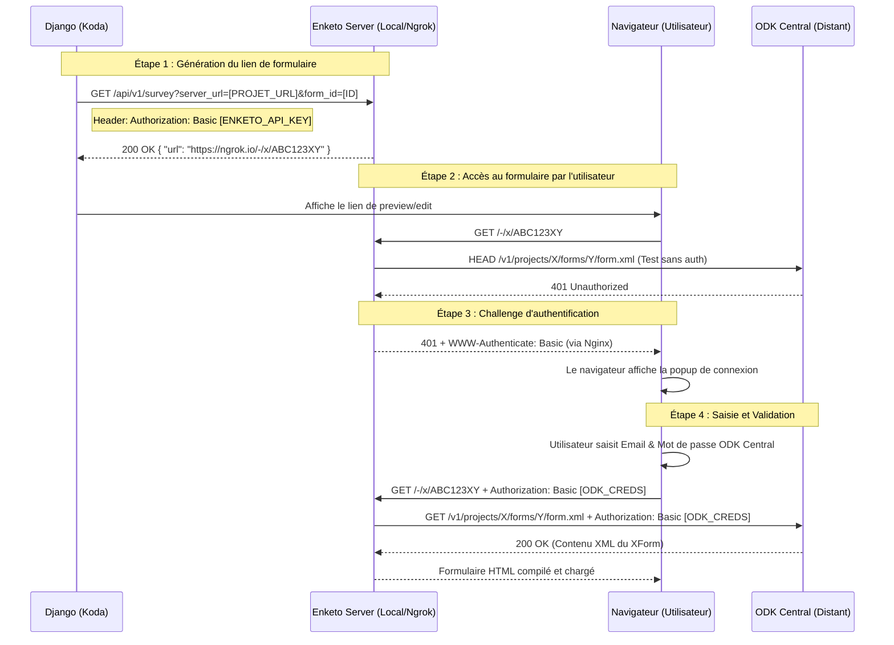

# Schéma Détaillé : Flux d'Authentification Basic Enketo

Ce document détaille le fonctionnement technique du mode d'authentification **Basic** entre votre application Django (Koda), le serveur Enketo et ODK Central.

---

## 1. Diagramme de Séquence (Mermaid)

---

## 2. Détails des Composants

### A. Clé API Enketo (`api key`)
- **Valeur** : `*********************************************`
- **Rôle** : Utilisée uniquement pour la communication **Serveur à Serveur** entre Django et Enketo. Elle permet de sécuriser la génération des URLs éphémères (`/-/x/...`).
- **Passage** : Transmise dans le header `Authorization: Basic [BASE64(API_KEY:)]`.

### B. Identifiants ODK Central (Credentials)
- **Rôle** : Utilisés pour la communication entre **Enketo et ODK Central**.
- **Source** : Saisis par l'utilisateur final dans la popup du navigateur lors de la première ouverture du formulaire.
- **Persistance** : Le navigateur mémorise ces identifiants pour la session actuelle. Ils ne sont jamais stockés en base de données par Enketo.

### C. Le rôle du "Proxy" Nginx
- Pour que le navigateur affiche la popup, Nginx doit intercepter le `401` de Central (relayé par Enketo) et s'assurer que le header `WWW-Authenticate: Basic realm="ODK Central"` est présent. C'est ce qui déclenche l'interface native de saisie.

---

## 3. Pourquoi ce flux est adapté à votre cas ?
1. **Support du Cross-Domain** : Contrairement aux cookies, les en-têtes `Authorization` ne sont pas bloqués entre `ngrok.io` et `insuco.net`.
2. **Standard OpenRosa** : C'est la méthode de repli universelle pour tous les clients ODK (Collect, Enketo).
3. **Simplicité** : Ne nécessite pas de synchronisation complexe de session entre Django et Central (tant que l'utilisateur connaît ses identifiants ODK).
