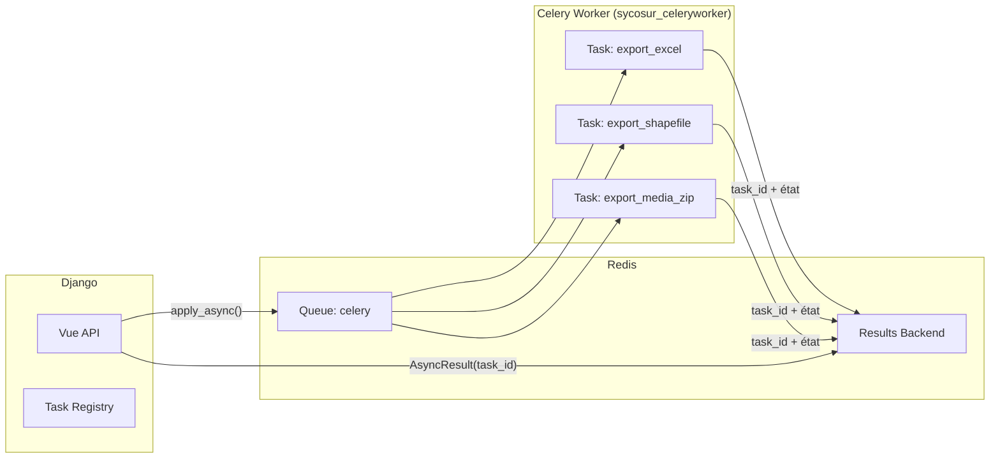

# Exports asynchrones avec Celery

## Pourquoi des exports asynchrones ?

Les exports de données ODK peuvent être **longs et coûteux** en ressources :

- Une enquête avec 10 000 soumissions et des groupes `repeat` peut générer un fichier Excel de plusieurs Mo
- La récupération des soumissions depuis ODK Central via OData est paginée et peut nécessiter plusieurs appels API
- Le traitement SIG (Shapefile) avec GeoPandas implique des calculs géométriques
- Le téléchargement des médias (photos) peut représenter des centaines de Mo

Traiter ces exports de manière **synchrone** (dans la requête HTTP) bloquerait le serveur Django pendant plusieurs minutes et dégraderait l'expérience de tous les utilisateurs.

---

## Architecture Celery dans Sycosur



---

## Cycle de vie d'un export

### 1. Déclenchement (Django API)

```python
# Exemple simplifié
from core_apps.odk.tasks import export_excel_task

result = export_excel_task.apply_async(
    args=[project_id, survey_id, user_id],
    countdown=0
)
task_id = result.id
# Retourner task_id au frontend → 202 Accepted
```

### 2. Traitement (Celery Worker)

```python
@shared_task(bind=True)
def export_excel_task(self, project_id, survey_id, user_id):
    # 1. Récupérer les soumissions depuis ODK Central (OData)
    submissions = fetch_submissions_from_odk(project_id, survey_id)

    # 2. Transformer en DataFrame pandas
    df = build_dataframe(submissions)

    # 3. Générer le fichier Excel (openpyxl)
    filepath = generate_excel(df, survey_id)

    # 4. Sauvegarder dans media/exports/
    return {"status": "success", "file_url": filepath}
```

### 3. Polling du statut (Frontend)

Le frontend interroge périodiquement l'état de la tâche :

```typescript
// RTK Query polling
const { data } = useGetExportStatusQuery(taskId, {
  pollingInterval: 2000, // toutes les 2 secondes
  skip: exportDone,
});
```

### 4. États possibles

| État Celery | Signification | Action frontend |
|---|---|---|
| `PENDING` | En attente dans la queue | Afficher spinner |
| `STARTED` | En cours de traitement | Afficher progression |
| `SUCCESS` | Terminé | Afficher bouton téléchargement |
| `FAILURE` | Erreur | Afficher message d'erreur |
| `REVOKED` | Annulé | — |

---

## Configuration Celery

```python
# config/celery_app.py
app = Celery("sycosur")
app.config_from_object("django.conf:settings", namespace="CELERY")
app.autodiscover_tasks()
```

Variables d'environnement :

```env
CELERY_BROKER_URL=redis://redis:6379/0
CELERY_RESULT_BACKEND=redis://redis:6379/0
```

---

## Monitoring avec Flower

Flower est l'interface web de monitoring Celery, accessible sur le port `5555` :

- **Workers** : état des workers actifs, charge CPU/mémoire
- **Tasks** : liste de toutes les tâches (en cours, terminées, échouées)
- **Queues** : longueur des queues Redis

```
http://localhost:5555  (dev)
```

Identifiants configurés via `CELERY_FLOWER_USER` et `CELERY_FLOWER_PASSWORD`.

---

## Gestion des erreurs et retry

En cas d'échec (timeout ODK Central, erreur mémoire), les tâches peuvent être relancées manuellement depuis Flower ou via l'API :

```python
@shared_task(bind=True, max_retries=3, default_retry_delay=60)
def export_excel_task(self, ...):
    try:
        ...
    except ODKConnectionError as exc:
        raise self.retry(exc=exc)
```

---

## Pourquoi Redis comme broker ?

Redis a été choisi comme broker Celery (et non RabbitMQ) pour sa **simplicité opérationnelle** :
- Déjà présent dans la stack (cache Django)
- Pas de configuration supplémentaire
- Performances suffisantes pour le volume de tâches d'export de Sycosur
- Persistance activée (`--appendonly yes`) pour ne pas perdre les tâches en cas de redémarrage
