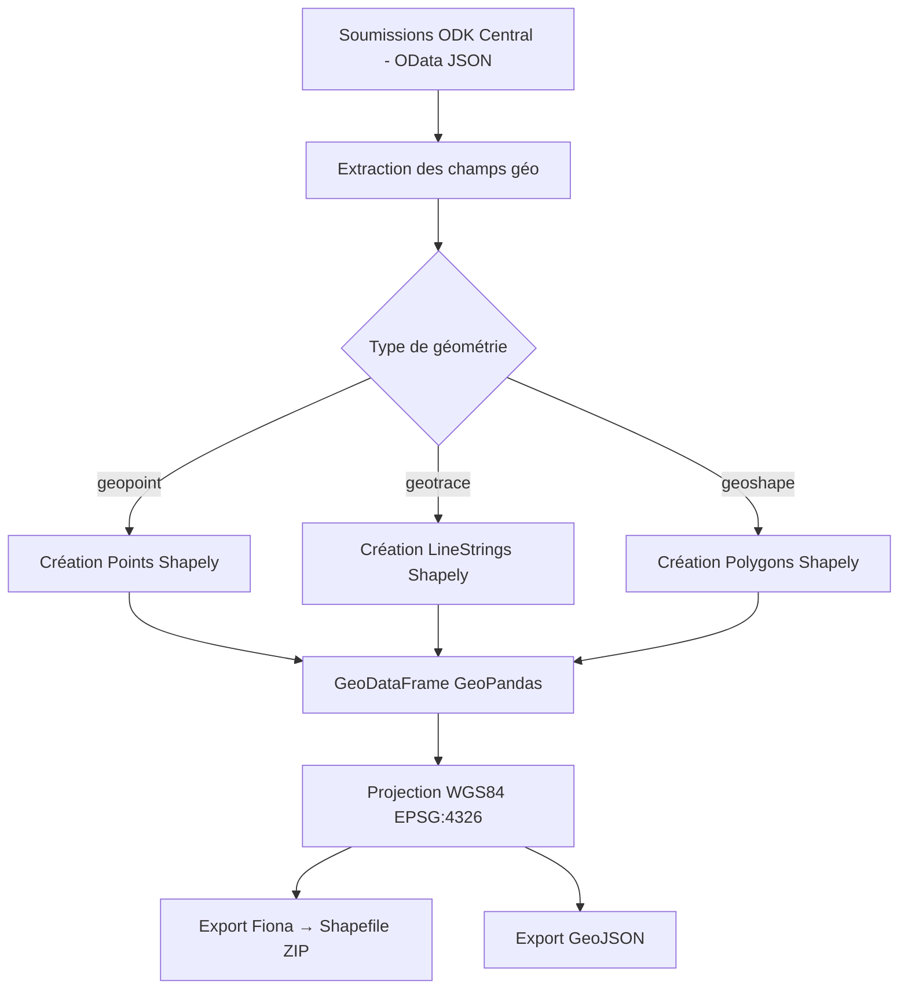

# Stratégie SIG et exports géographiques

## Contexte

Les enquêtes ODK collectées via Koda contiennent fréquemment des données géographiques : coordonnées GPS des ménages enquêtés, tracés de routes, délimitations de zones. Ces données ont une valeur analytique importante pour les projets Insuco (études d'impact, cartographie sociale, suivi terrain).

Koda intègre une **chaîne de traitement SIG complète** pour transformer les soumissions ODK en données géographiques exploitables.

---

## Stack SIG choisie

| Bibliothèque | Rôle | Pourquoi ce choix |
|---|---|---|
| **Fiona** | Lecture/écriture de formats vecteur (Shapefile, GeoJSON) | Standard Python pour l'I/O SIG, léger, sans dépendance GDAL complexe |
| **GeoPandas** | Manipulation de données géographiques en DataFrame | Combine pandas et Shapely, idéal pour les transformations tabulaires + géométriques |
| **Shapely** | Opérations géométriques (points, lignes, polygones) | Bibliothèque de référence pour la géométrie computationnelle en Python |

Ces trois bibliothèques forment l'écosystème Python SIG standard, sans nécessiter d'installation de logiciels SIG lourds (QGIS, ArcGIS) sur le serveur.

---

## Types de géométries supportés

ODK Central supporte trois types de questions géographiques, tous gérés par Koda :

| Type ODK | Géométrie | Export Shapefile |
|---|---|---|
| `geopoint` | Point (lat, lon, altitude, précision) | Couche de points |
| `geotrace` | Ligne (séquence de points GPS) | Couche de lignes |
| `geoshape` | Polygone (zone fermée) | Couche de polygones |

---

## Pipeline de traitement SIG



---

## Format des coordonnées ODK

ODK Central stocke les coordonnées au format texte :

```
# geopoint : "latitude longitude altitude precision"
"-4.3217 15.3224 320.5 5.2"

# geotrace : points séparés par ";"
"-4.3217 15.3224 320.5 5.2;-4.3220 15.3230 321.0 4.8;..."

# geoshape : idem geotrace, premier = dernier point (polygone fermé)
"-4.3217 15.3224 320.5 5.2;-4.3220 15.3230 321.0 4.8;...;-4.3217 15.3224 320.5 5.2"
```

Le service de traitement SIG parse ces chaînes et crée les objets géométriques Shapely correspondants.

---

## Carte interactive

En plus des exports fichiers, Koda propose une **vue carte interactive** dans l'interface web :

- Affichage des soumissions géolocalisées sur une carte (Leaflet / MapLibre)
- Clustering automatique pour les grandes densités de points
- Clic sur un point → panneau de détail de la soumission (`SubmissionDetailSheet`)
- Filtrage par date, enquêteur, statut

Cette vue est implémentée dans `client/components/maps/`.

---

## Système de coordonnées

Tous les exports utilisent **WGS84 (EPSG:4326)**, le système de référence GPS universel. C'est le format natif d'ODK Central et le plus compatible avec les outils SIG courants (QGIS, ArcGIS, Google Maps, Mapbox).

Si une reprojection est nécessaire (ex. UTM local), elle doit être effectuée dans l'outil SIG de destination après import.

---

## Bonnes pratiques pour les formulaires ODK

Pour maximiser la qualité des exports SIG :

1. **Toujours nommer les questions géo** avec des noms explicites (`gps_menage`, `trace_route`)
2. **Configurer la précision minimale** dans le formulaire XLSForm (`accuracy-threshold`)
3. **Éviter les géométries vides** : utiliser `required = true` pour les questions géo critiques
4. **Tester sur le terrain** avant le déploiement massif pour valider la précision GPS
