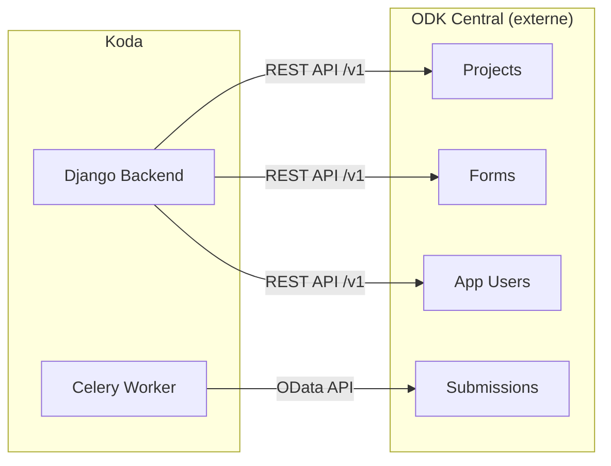

# Intégration ODK Central

## Pourquoi ODK Central ?

Koda n'est pas un serveur de collecte — c'est une **couche de supervision et d'export** au-dessus d'ODK Central. Ce choix architectural repose sur plusieurs raisons :

1. **ODK Central est la référence** : standard de facto pour la collecte de données terrain, maintenu par la communauté ODK avec des milliers de déploiements dans le monde
2. **Compatibilité mobile** : ODK Collect (Android) et Enketo (web) sont nativement compatibles avec ODK Central via le protocole OpenRosa
3. **API publique et stable** : ODK Central expose une API REST complète (OpenAPI 3.0) qui permet à Koda de tout piloter programmatiquement
4. **Séparation des responsabilités** : ODK Central gère la collecte et le stockage brut ; Koda gère la supervision, les permissions métier et les exports enrichis

---

## Architecture de l'intégration



---

## Pool d'utilisateurs ODK

Koda utilise un **pool de comptes administrateurs ODK Central** pour effectuer toutes les opérations API. Ces comptes sont configurés via :

```env
ODK_ADMIN_EMAIL=admin@insuco.com
ODK_ADMIN_PASSWORD=...
ODK_ADMIN_EMAIL2=admin2@insuco.com   # optionnel, pour la redondance
ODK_ADMIN_PASSWORD2=...
```

Ces comptes doivent avoir le rôle **Administrator** sur ODK Central. Ils ne correspondent pas aux utilisateurs finaux de Koda.

---

## Opérations effectuées via l'API ODK Central

### Gestion des formulaires

| Opération Koda | Appel ODK Central |
|---|---|
| Importer un XLSForm | `POST /projects/{id}/forms` |
| Publier un formulaire | `PATCH /projects/{id}/forms/{xmlFormId}` (state: open) |
| Créer une nouvelle version | `POST /projects/{id}/forms/{xmlFormId}/draft` |
| Lister les versions | `GET /projects/{id}/forms/{xmlFormId}/versions` |

### Gestion des App Users

| Opération Koda | Appel ODK Central |
|---|---|
| Créer un App User | `POST /projects/{id}/app-users` |
| Assigner un formulaire | `POST /projects/{id}/forms/{xmlFormId}/assignments` |
| Révoquer l'accès | `DELETE /projects/{id}/app-users/{id}` |

### Récupération des soumissions

Les soumissions sont récupérées via l'**API OData** d'ODK Central, qui permet des requêtes filtrées et paginées :

```
GET /projects/{id}/forms/{xmlFormId}.svc/Submissions
    ?$top=1000
    &$skip=0
    &$filter=__system/submissionDate ge 2026-01-01
```

L'API OData retourne les données en JSON structuré, avec les groupes `repeat` comme sous-tables séparées.

---

## Gestion des certificats SSL

En développement avec un ODK Central auto-signé :
```env
ODK_VERIFY_SSL=False
```

En production, toujours activer la vérification :
```env
ODK_VERIFY_SSL=True
```

---

## Synchronisation et cohérence des données

Koda maintient une **copie locale des métadonnées** (projets, formulaires, versions) dans PostgreSQL pour des raisons de performance. Les soumissions elles-mêmes restent dans ODK Central et sont récupérées à la demande (export, affichage tableau).

Cette approche garantit :
- **Rapidité** : les listes de projets/formulaires sont servies depuis PostgreSQL
- **Fraîcheur** : les soumissions sont toujours récupérées en temps réel depuis ODK Central
- **Résilience** : si ODK Central est temporairement indisponible, l'interface reste partiellement fonctionnelle
