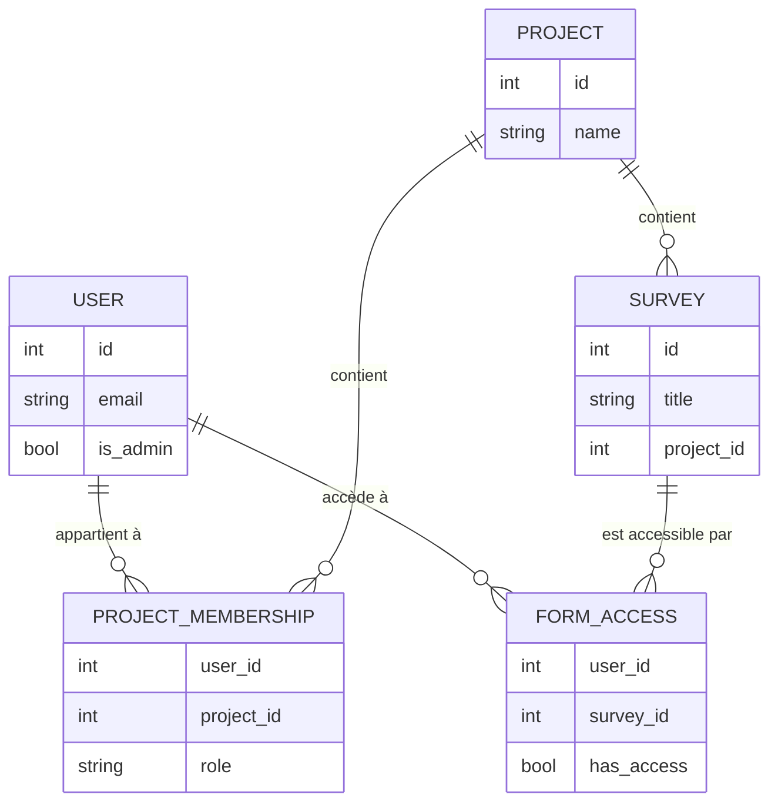

# Gestion des rôles et permissions

## Philosophie du modèle

Koda adopte un modèle de permissions **hiérarchique et contextuel** : les droits d'un utilisateur dépendent à la fois de son rôle global sur la plateforme et de son rôle dans chaque projet.

Ce modèle répond aux besoins terrain d'Insuco :
- Des **administrateurs** qui gèrent la plateforme globalement
- Des **chefs de projet** qui pilotent leurs enquêtes de manière autonome
- Des **enquêteurs/analystes** qui consultent et exportent les données de leurs projets

---

## Les trois rôles

### Administrateur

Rôle de niveau plateforme. Un administrateur peut :
- Créer et supprimer des projets
- Inviter et révoquer n'importe quel utilisateur
- Accéder à tous les projets et toutes les données
- Accéder à l'interface d'administration Django (`/secret/`)
- Recevoir les notifications critiques (révocations, projets sans PM)

### Project Manager (PM)

Rôle de niveau projet. Un PM peut :
- Gérer les enquêtes de ses projets (import, publication, suppression)
- Inviter des utilisateurs dans ses projets
- Changer les rôles des membres de ses projets (User ↔ PM)
- Consulter et exporter toutes les données de ses projets

!!! warning "Projet sans PM"
    Si un projet n'a aucun PM actif, une alerte visuelle est affichée dans l'interface. Les administrateurs reçoivent une notification. Il est recommandé d'assigner au moins un PM par projet actif.

### User

Rôle de niveau projet. Un User peut :
- Consulter les soumissions des formulaires auxquels il a accès
- Exporter les données (Excel, CSV, SHP, ZIP)
- Accéder à la vue carte
- Mettre à jour ses informations personnelles et son mot de passe

---

## Modèle de données des permissions

---

## Synchronisation avec ODK Central

Les permissions Koda sont **synchronisées avec ODK Central** via son système d'App Users :

1. Quand un utilisateur Koda reçoit accès à un formulaire → un **App User ODK** est créé/mis à jour
2. Quand l'accès est révoqué → l'App User ODK est supprimé ou désactivé
3. Les App Users ODK permettent à ODK Collect de télécharger les formulaires autorisés

Cette synchronisation est transparente pour l'utilisateur final.

---

## Notifications et alertes automatiques

| Événement | Notification | Destinataire |
|---|---|---|
| Invitation envoyée | Email avec lien d'activation | Utilisateur invité |
| Invitation expirée | Alerte dans la liste des invitations | Administrateur |
| Révocation d'un email `@insuco.com` | Email de notification | Tous les administrateurs |
| Suppression d'un utilisateur externe | Email de notification | Tous les administrateurs |
| Projet sans PM actif | Bandeau d'alerte dans l'interface | Administrateurs |
| Projet archivé | Indicateur visuel sur la carte projet | Tous les membres |

---

## Évolution des rôles

### Promouvoir un User en PM

Un administrateur ou un PM existant peut promouvoir un User :

1. **Form Access** → menu contextuel de l'utilisateur → **Changer le rôle** → **Project Manager**

### Rétrograder un PM en User

Même procédure, sélectionner **User**.

### Passer un User en Administrateur

Uniquement via l'interface d'administration Django (`/secret/admin/`) par un superuser.

---

## Référence technique

Pour les détails d'implémentation Django (modèles, serializers, permissions DRF) :

- [`backend/docs/permission-guide.md`](../../backend/docs/permission-guide.md)
- [`backend/docs/sys-rights-guide.md`](../../backend/docs/sys-rights-guide.md)
