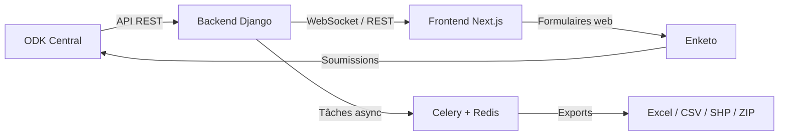

# Sycosur — Documentation

**Sycosur** est une plateforme web de gestion d'enquêtes de terrain développée par [Insuco](https://insuco.net). Elle permet de piloter l'intégralité du cycle de vie des enquêtes ODK : création, déploiement, collecte, supervision et export des données.

---

## Vue d'ensemble

---

## Fonctionnalités principales

| Domaine | Fonctionnalités |
|---|---|
| **Enquêtes** | Import XLSForm, versioning automatique, publication, archivage |
| **Collecte** | Liens web (Enketo), ODK Collect, soumissions multiples |
| **Supervision** | Dashboard KPI, tableau de soumissions, graphique journalier |
| **Exports** | Excel, CSV, Shapefile, ZIP multimédia — traitement asynchrone |
| **SIG** | Carte interactive, analyse spatiale (Fiona, GeoPandas) |
| **Utilisateurs** | Rôles (Admin / PM / User), invitations email, SSO Google |
| **Infrastructure** | Docker Compose, GitHub Actions CI/CD, Nginx, PostgreSQL |

---

## Navigation rapide

- :material-school: **[Tutoriels](tutorials/getting-started.md)**  
  Apprenez en faisant — installation, première enquête, premiers exports

- :material-wrench: **[Guides pratiques](how-to/deploy-production.md)**  
  Résolvez des problèmes concrets — déploiement, exports, permissions

- :material-book-open: **[Référence](reference/architecture.md)**  
  Architecture, variables d'environnement, API REST

- :material-lightbulb: **[Explications](explanation/odk-integration.md)**  
  Comprendre les choix techniques — ODK, Celery, SIG, rôles

---

## Stack technique

- **Backend** : Django 5, Django REST Framework, Celery, PostgreSQL, Redis
- **Frontend** : Next.js 15, TypeScript, Redux Toolkit, Tailwind CSS
- **Collecte** : ODK Central (API v1), Enketo Express 7.6
- **SIG** : Fiona, GeoPandas, Shapely
- **Infrastructure** : Docker Compose, Nginx, GitHub Actions
- **Domaine** : `sycosur.insuco.net`
