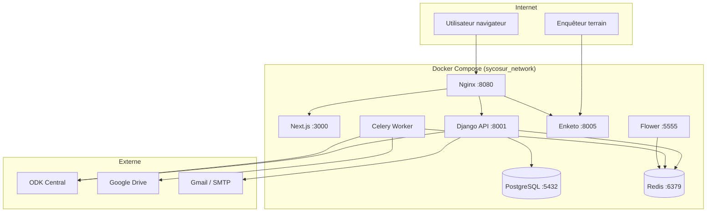
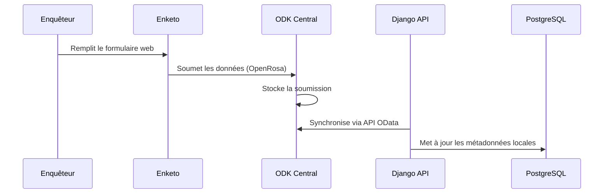
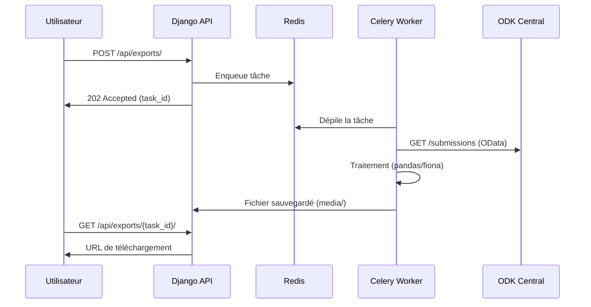

# Architecture de Sycosur

## Vue d'ensemble

Sycosur est une application web full-stack organisée en microservices Docker. Elle s'appuie sur ODK Central comme serveur de collecte de données et expose une interface de supervision et d'export enrichie.

---

## Schéma d'architecture



---

## Services Docker

| Service | Image | Rôle | Port exposé |
|---|---|---|---|
| `nginx` | Custom (local/prod) | Reverse proxy, fichiers statiques | `8080` |
| `api` | `sycosur_api` | Backend Django REST | `8001` (interne) |
| `client` | `sycosur_client` | Frontend Next.js | `3000` (interne) |
| `postgres` | Custom PostgreSQL | Base de données relationnelle | `5432` |
| `redis` | `redis:7.0-alpine` | Broker Celery + cache | interne |
| `celeryworker` | `sycosur_celeryworker` | Traitement async des exports | — |
| `enketo` | `ghcr.io/enketo/enketo:7.6.1` | Formulaires web ODK | `8005` (interne) |
| `flower` | `sycosur_flower` | Monitoring Celery | `5555` |
| `mailpit` | `axllent/mailpit:v1.15` | Serveur mail (dev uniquement) | `8025`, `1025` |

---

## Structure du dépôt

```
sycosur/
├── backend/                    # Application Django
│   ├── config/                 # Configuration Django (settings, urls, celery)
│   │   ├── settings/
│   │   │   ├── base.py
│   │   │   ├── local.py
│   │   │   └── production.py
│   │   ├── celery_app.py
│   │   └── urls.py
│   ├── core_apps/              # Applications Django métier
│   │   ├── common/             # Modèles et utilitaires partagés
│   │   ├── invitations/        # Gestion des invitations email
│   │   ├── odk/                # Intégration ODK Central (cœur du système)
│   │   │   └── services/       # Services métier (submissions, exports, SIG)
│   │   ├── profiles/           # Profils utilisateurs
│   │   ├── projects/           # Gestion des projets
│   │   └── users/              # Authentification et gestion des comptes
│   ├── docs/                   # Documentation technique backend
│   └── .envs/                  # Variables d'environnement (non versionnées)
│
├── client/                     # Application Next.js
│   ├── app/                    # Pages (App Router Next.js 15)
│   ├── components/             # Composants React
│   │   ├── maps/               # Carte interactive (soumissions géolocalisées)
│   │   ├── lists/              # Tableaux de données (soumissions, formulaires)
│   │   └── ...
│   ├── lib/
│   │   └── redux/              # State management (Redux Toolkit)
│   │       └── features/
│   │           ├── surveys/    # API slice enquêtes
│   │           └── api/        # Base API slice
│   └── messages/               # Traductions i18n (fr, es)
│
├── docs/                       # Documentation (ce dossier)
├── docker/                     # Configurations Docker spécifiques
├── scripts/                    # Scripts utilitaires
├── local.yml                   # Docker Compose développement
├── prod.yml                    # Docker Compose production
└── Makefile                    # Commandes raccourcies
```

---

## Flux de données principal

### Collecte d'une soumission



### Export asynchrone



---

## Stack technique détaillée

### Backend

| Composant | Technologie | Version |
|---|---|---|
| Framework web | Django | 5.x |
| API REST | Django REST Framework | 3.x |
| Tâches async | Celery | 5.x |
| ORM | Django ORM + PostgreSQL | — |
| Auth | JWT (SimpleJWT) + Google OAuth | — |
| Export tabulaire | pandas, openpyxl | — |
| Export SIG | Fiona, GeoPandas, Shapely | — |
| Client ODK | Requêtes HTTP (httpx/requests) | — |

### Frontend

| Composant | Technologie | Version |
|---|---|---|
| Framework | Next.js (App Router) | 15.x |
| Langage | TypeScript | 5.x |
| State management | Redux Toolkit + RTK Query | — |
| UI | Tailwind CSS + shadcn/ui | — |
| Carte | Leaflet / MapLibre | — |
| i18n | next-intl | — |
| Internationalisation | Français, Espagnol | — |

---

## Sécurité

- **Authentification** : JWT avec refresh token + SSO Google OAuth2
- **HTTPS** : Obligatoire en production (`COOKIE_SECURE=True`)
- **Admin Django** : URL secrète configurable (`DJANGO_ADMIN_URL`)
- **Secrets** : Variables d'environnement, jamais dans le code
- **ODK SSL** : `ODK_VERIFY_SSL=True` en production
