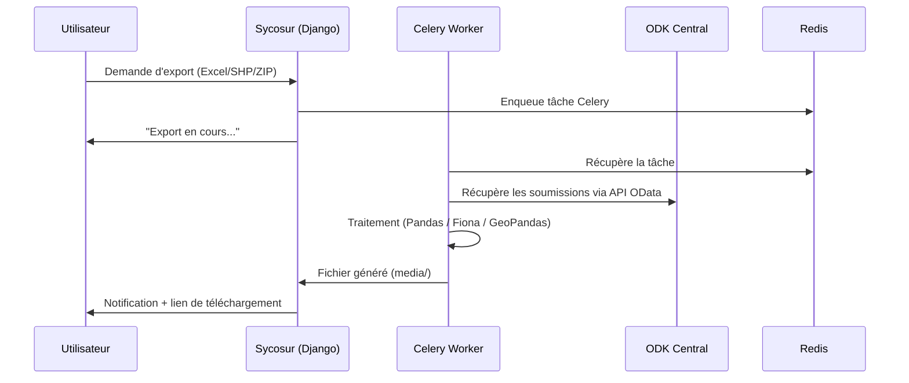

# Exporter ses premières données

Ce tutoriel vous montre comment exporter les soumissions d'une enquête dans les différents formats disponibles : Excel, CSV, Shapefile et ZIP multimédia.

## Prérequis

- Une enquête avec au moins quelques soumissions
- Être connecté avec un compte ayant accès au projet

---

## Les formats d'export disponibles

| Format | Contenu | Usage typique |
|---|---|---|
| **Excel (.xlsx)** | Toutes les réponses tabulaires | Analyse, reporting |
| **CSV** | Données brutes tabulaires | Import dans d'autres outils |
| **Shapefile (.shp)** | Données géolocalisées | SIG (QGIS, ArcGIS) |
| **ZIP multimédia** | Photos, audio, vidéo des soumissions | Archivage terrain |

---

## Étape 1 — Accéder aux exports

1. Dans le **Survey Dashboard**, cliquez sur l'onglet **Exports** (ou le bouton d'export)
2. Sélectionnez le format souhaité

---

## Étape 2 — Lancer un export Excel

1. Cliquez sur **Exporter en Excel**
2. Un message de confirmation apparaît : *"Export en cours de traitement..."*
3. L'export est traité **en arrière-plan** par Celery — vous pouvez continuer à utiliser l'application
4. Une notification apparaît quand le fichier est prêt
5. Cliquez sur **Télécharger** pour récupérer le fichier `.xlsx`

!!! info "Traitement asynchrone"
    Les exports sont traités par Celery pour ne pas bloquer l'interface. Pour les enquêtes volumineuses (milliers de soumissions), le traitement peut prendre quelques minutes. Vous pouvez suivre l'avancement dans [Flower](http://localhost:5555).

---

## Étape 3 — Exporter en Shapefile (données SIG)

L'export Shapefile est disponible uniquement si votre formulaire contient des **questions de type `geopoint`, `geotrace` ou `geoshape`**.

1. Cliquez sur **Exporter en Shapefile**
2. Un fichier `.zip` contenant les fichiers `.shp`, `.dbf`, `.shx`, `.prj` est généré
3. Ouvrez le fichier dans QGIS ou ArcGIS

!!! tip "Projection géographique"
    Les exports Shapefile utilisent le système de coordonnées **WGS84 (EPSG:4326)**, compatible avec tous les SIG courants.

---

## Étape 4 — Exporter les médias (ZIP)

Pour récupérer les photos et fichiers multimédias collectés :

1. Cliquez sur **Exporter les médias (ZIP)**
2. Le ZIP contient tous les fichiers organisés par soumission
3. Les noms de fichiers correspondent aux identifiants de soumission ODK

---

## Suivi des exports avec Flower

Pour surveiller l'état de vos exports en temps réel :

1. Ouvrez [http://localhost:5555](http://localhost:5555) (Flower)
2. Connectez-vous avec `admin` / `pass123456` (dev local)
3. Dans l'onglet **Tasks**, filtrez par `export` pour voir vos tâches en cours

```
État des tâches Celery :
  PENDING  → En attente de traitement
  STARTED  → En cours de traitement
  SUCCESS  → Terminé, fichier disponible
  FAILURE  → Erreur (consultez les logs)
```

---

## Résumé du flux d'export


