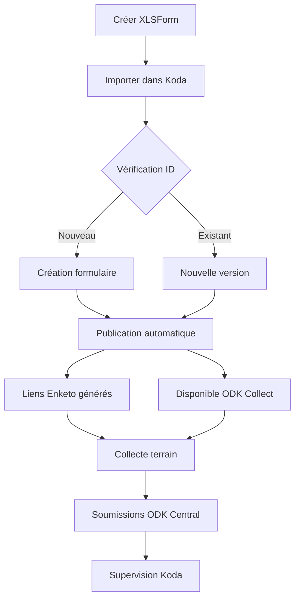

# Créer et déployer sa première enquête

Ce tutoriel vous guide de la création d'un formulaire XLSForm jusqu'à sa mise en ligne pour la collecte terrain via Enketo ou ODK Collect.

## Prérequis

- Koda installé et accessible (voir [Installation locale](getting-started.md))
- Un fichier XLSForm `.xlsx` prêt (ou utilisez l'exemple ci-dessous)
- Être connecté avec un compte **Administrateur** ou **Project Manager**

---

## Étape 1 — Créer ou sélectionner un projet

1. Connectez-vous à Koda (`http://localhost:8080`)
2. Dans la barre latérale, cliquez sur **Projets**
3. Sélectionnez un projet existant ou créez-en un nouveau

!!! info "Projets et ODK Central"
    Chaque projet Koda est lié à un projet ODK Central. La synchronisation est automatique via l'API ODK Central configurée dans vos variables d'environnement.

---

## Étape 2 — Importer un formulaire XLSForm

1. Dans le projet, accédez à **Form versions**
2. Cliquez sur **Importer un formulaire**
3. Sélectionnez votre fichier `.xlsx`
4. Koda vérifie l'identifiant du questionnaire et crée automatiquement une nouvelle version

!!! warning "Versioning automatique"
    Si un formulaire avec le même identifiant existe déjà, une nouvelle version est créée automatiquement. L'ancienne version reste accessible pour les soumissions existantes.

---

## Étape 3 — Vérifier le formulaire

Après l'import, accédez à la page **Overview** du formulaire pour vérifier :

- ✅ Le titre et l'identifiant du formulaire
- ✅ La version active
- ✅ Les pièces jointes requises (médias, listes de choix externes)

---

## Étape 4 — Publier le formulaire

La publication est **automatique** après l'import réussi. Le formulaire est immédiatement disponible pour la collecte.

Pour vérifier le statut :

1. Allez dans **Form versions**
2. La version active est marquée comme **Publiée**
3. Cliquez sur **Mettre à jour** si vous souhaitez forcer une re-synchronisation avec ODK Central

---

## Étape 5 — Générer les liens de collecte

### Via Enketo (formulaire web)

1. Accédez au **Survey Dashboard** de votre enquête
2. Dans la section **Web Forms**, deux types de liens sont disponibles :
   - **Soumission unique** : l'enquêteur ne peut soumettre qu'une fois
   - **Soumissions multiples** : l'enquêteur peut soumettre plusieurs fois
3. Copiez et partagez le lien avec vos enquêteurs

### Via ODK Collect (application mobile)

1. Dans ODK Collect, configurez le serveur ODK Central
2. Le formulaire apparaît automatiquement dans la liste des formulaires disponibles
3. Les enquêteurs peuvent télécharger et remplir le formulaire hors ligne

---

## Étape 6 — Superviser les soumissions

Une fois les premières soumissions reçues :

1. Accédez au **Survey Dashboard**
2. Consultez les **KPIs** : nombre total de soumissions, progression journalière
3. Ouvrez le **tableau de soumissions** pour visualiser et valider les données
4. Utilisez la **vue carte** pour visualiser les soumissions géolocalisées

---

## Résumé du cycle de vie

